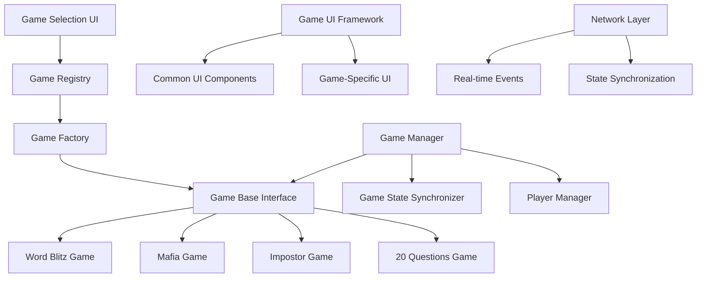

# Design Document

## Overview

The multi-game system architecture extends the existing game framework to support multiple party games (Word Blitz, Mafia, Impostor, 20 Questions) through a modular, plugin-based approach. The system leverages the existing GameBase interface and GameRegistry while adding game-specific implementations and a unified game selection UI.

## Architecture

### Core Components



### Game Architecture Layers

1. **Game Selection Layer**: UI for choosing games and configuring game-specific settings
2. **Game Management Layer**: Handles game lifecycle, state management, and player coordination
3. **Game Implementation Layer**: Individual game logic implementations extending GameBase
4. **UI Framework Layer**: Common UI patterns and game-specific UI components
5. **Network Layer**: Real-time synchronization and event broadcasting

## Components and Interfaces

### 1. Enhanced Game Registry

Extends the existing GameRegistry to support game metadata and configuration:

```dart
class GameMetadata {
  final String gameType;
  final String displayName;
  final String description;
  final int minPlayers;
  final int maxPlayers;
  final Duration estimatedDuration;
  final List<String> requiredPermissions;
  final Map<String, dynamic> defaultConfig;
}

class EnhancedGameRegistry extends GameRegistry {
  static final Map<String, GameMetadata> _gameMetadata = {};
  
  static void registerGameWithMetadata<T extends GameBase>(
    String gameType, 
    T Function() factory,
    GameMetadata metadata
  );
  
  static List<GameMetadata> getAvailableGames();
  static GameMetadata? getGameMetadata(String gameType);
}
```

### 2. Game Selection Manager

Handles game selection UI and configuration:

```dart
class GameSelectionManager {
  Future<GameSelectionResult> showGameSelection(BuildContext context);
  Future<GameConfig> configureGame(String gameType, Map<String, dynamic> initialConfig);
  void saveGamePreferences(String gameType, GameConfig config);
}

class GameSelectionResult {
  final String gameType;
  final GameConfig config;
  final bool cancelled;
}
```

### 3. Word Blitz Game Implementation

Specific implementation for Word Blitz game mechanics:

```dart
class WordBlitzGame extends GameBase {
  // Game state
  String currentTheme;
  String currentLetter;
  List<String> activePlayers;
  List<String> eliminatedPlayers;
  int currentRound;
  bool isRoundActive;
  
  // Host controls
  Future<void> setTheme(String theme);
  Future<void> generateNewLetter();
  Future<void> eliminatePlayer(String playerId);
  Future<void> startNewRound();
  Future<void> endRound();
}
```

### 4. Game UI Framework

Common UI components and patterns for all games:

```dart
abstract class GameUIWidget extends StatefulWidget {
  final GameBase game;
  final bool isHost;
  final String currentPlayerId;
}

class GameControlPanel extends GameUIWidget {
  // Common game controls (pause, settings, exit)
}

class PlayerStatusList extends GameUIWidget {
  // Real-time player list with status indicators
}

class GameThemeSelector extends StatefulWidget {
  // Theme selection for Word Blitz
}

class HostControlPanel extends StatefulWidget {
  // Host-specific controls for managing games
}
```

### 5. Real-time Event System

Enhanced event system for game-specific events:

```dart
enum WordBlitzEventType {
  themeSelected,
  letterGenerated,
  playerEliminated,
  roundStarted,
  roundEnded,
  gameWon,
}

class WordBlitzEvent extends BasicGameEvent {
  final WordBlitzEventType wordBlitzType;
  
  WordBlitzEvent({
    required this.wordBlitzType,
    required String gameId,
    required Map<String, dynamic> data,
  }) : super(
    type: wordBlitzType.toString(),
    gameId: gameId,
    data: data,
  );
}
```

## Data Models

### Game Configuration Models

```dart
class GameConfig {
  final String gameType;
  final Map<String, dynamic> settings;
  final List<String> playerIds;
  final String hostId;
  
  // Game-specific configurations
  factory GameConfig.wordBlitz({
    required List<String> availableThemes,
    required int roundsToWin,
    required Duration roundTimeout,
  });
}

class WordBlitzConfig extends GameConfig {
  final List<String> availableThemes;
  final int roundsToWin;
  final Duration roundTimeout;
  final bool allowCustomThemes;
}
```

### Game State Models

```dart
class WordBlitzState {
  final String currentTheme;
  final String? currentLetter;
  final List<PlayerStatus> players;
  final int currentRound;
  final bool isRoundActive;
  final String? winner;
  final DateTime? roundStartTime;
  
  Map<String, dynamic> toJson();
  factory WordBlitzState.fromJson(Map<String, dynamic> json);
}

class PlayerStatus {
  final String playerId;
  final String playerName;
  final bool isActive;
  final bool isEliminated;
  final int roundsWon;
}
```

## Error Handling

### Game-Specific Error Types

```dart
enum GameSpecificErrorType {
  invalidTheme,
  noActivePlayers,
  roundNotActive,
  hostPermissionRequired,
  playerAlreadyEliminated,
}

class WordBlitzError extends GameError {
  final GameSpecificErrorType wordBlitzErrorType;
  
  WordBlitzError(String message, this.wordBlitzErrorType) 
    : super(message, errorType: GameErrorType.gameLogic);
}
```

### Error Recovery Strategies

- **Theme Selection Errors**: Fallback to default themes
- **Player Elimination Errors**: Allow host to manually adjust player status
- **Round State Errors**: Provide host controls to reset round state
- **Network Sync Errors**: Re-synchronize game state from host

## Testing Strategy

### Unit Testing

1. **Game Logic Tests**
   - Word Blitz game mechanics (theme selection, letter generation, elimination)
   - Player state management
   - Round progression logic
   - Win condition detection

2. **Game Registry Tests**
   - Game registration and factory creation
   - Metadata management
   - Game type validation

3. **State Management Tests**
   - Game state serialization/deserialization
   - Event handling and propagation
   - Error state recovery

### Integration Testing

1. **Game Flow Tests**
   - Complete game session from start to finish
   - Host and player interaction scenarios
   - Network synchronization during gameplay

2. **UI Integration Tests**
   - Game selection flow
   - Real-time UI updates during gameplay
   - Error handling in UI components

3. **Multi-Game Tests**
   - Switching between different game types
   - Game registry with multiple games
   - Resource cleanup between games

### End-to-End Testing

1. **Multi-Device Testing**
   - Host device controlling Word Blitz game
   - Multiple player devices receiving real-time updates
   - Network disconnection and reconnection scenarios

2. **Performance Testing**
   - Game state synchronization latency
   - UI responsiveness during rapid game events
   - Memory usage with multiple concurrent games

### Testing Utilities

```dart
class GameTestUtils {
  static WordBlitzGame createTestWordBlitzGame();
  static List<String> createTestPlayers(int count);
  static GameConfig createTestGameConfig(String gameType);
  static void simulateHostAction(GameBase game, String action, Map<String, dynamic> data);
}

class MockGameRegistry extends EnhancedGameRegistry {
  // Mock implementation for testing
}
```

## Implementation Phases

### Phase 1: Core Architecture
- Enhance GameRegistry with metadata support
- Create GameSelectionManager and UI
- Implement common UI framework components

### Phase 2: Word Blitz Implementation
- Implement WordBlitzGame class
- Create Word Blitz specific UI components
- Add theme management system

### Phase 3: Integration and Testing
- Integrate Word Blitz with existing game system
- Implement real-time synchronization
- Add comprehensive error handling

### Phase 4: Future Games Foundation
- Create templates for additional games
- Document game development guidelines
- Prepare architecture for Mafia, Impostor, and 20 Questions